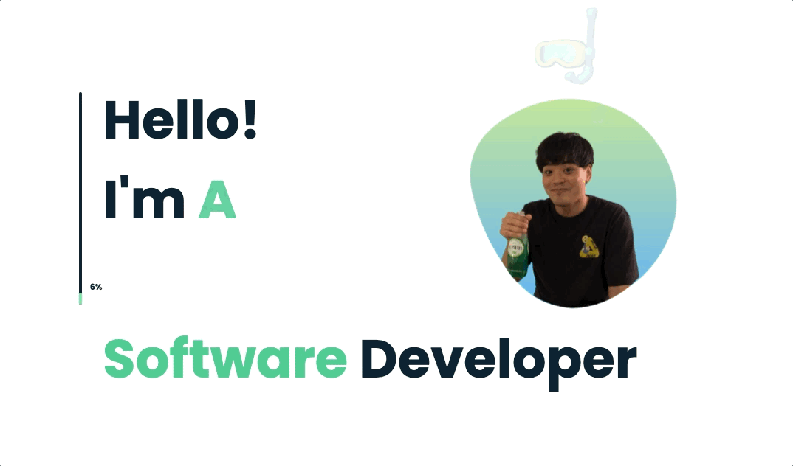

# Arthur 金

## Toy Projects

### [canvas dojo](https://github.com/znxkznxk1030/canvas-dojo) 

- A plugin for learning and experimenting html5 canvas
- 1k+ downloads
- [vscode marketplace](https://marketplace.visualstudio.com/items?itemName=ArthurKim.canvas-dojo)

### [quick deploy](https://github.com/znxkznxk1030/vscode-tookit-aws-lambda-java) 

- Support for deploying aws lambda funtion

<!-- ### [should-do list](https://github.com/znxkznxk1030/should-do-list)

- A should-do list app with kakao login -->

## Daliy Study

### AWS

- [AWS | 고가용성 구성에서 세션을 유지 3가지 방법](https://github.com/znxkznxk1030/session-persisting-in-HA-on-aws)
- [AWS T2 교육 | SAA 따면서 공부했던것 정리](https://github.com/znxkznxk1030/aws-t2/tree/main/ArchitectOnAWS/training4)

### Spring Security

- [spring-security-email-validation](https://github.com/znxkznxk1030/spring-security-email-validation) | spring-secuirty를 이용한 이메일 인증 PoC
- [spring-boot-webchat](https://github.com/znxkznxk1030/spring-boot-webchat) | spring과 websocket, redis를 이용한 p2p 웹 채팅
- [should-do-list](https://github.com/znxkznxk1030/should-do-list)           | Kakao OAuth2의 authentication code 인증 방법을 이용한 로그인 PoC
- [oauth2-authentication-code-learn](https://github.com/znxkznxk1030/oauth2-authentication-code-learn)| OAuth 서버 구축 PoC
